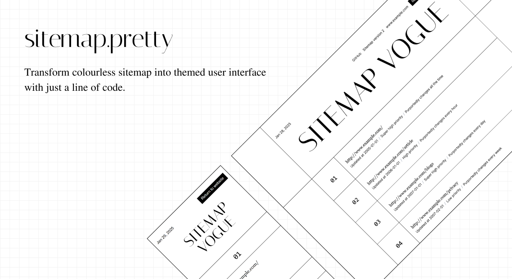

# sitemap.pretty

[sitemap.pretty](/) is a collection of stylesheets for `sitemap.xml` and `sitemapindex.xml` that adheres to the [sitemap protocol](https://www.sitemaps.org/protocol.html).



## Usages

To use the stylesheet, just add the following one liner in the top of your XML file after the XML declaration header.

```xml
<?xml-stylesheet href="..." type="text/xsl"?>
```

The `href` attribute is where it points to the XSLT stylesheet file. Here are the 3 ways you can do that.

1. By CDN. However, I am still working on this and is unavailable at the moment.
2. By base 64. The digest can be found in `xsl-encoded.txt` that starts with `data:text/xsl;base64` in the release artifact.
   ```xml
   <?xml-stylesheet href="data:text/xsl;base64,PD94b...D4NCg==" type="text/xsl"?>
   ```
3. Host the stylesheet yourself. You can download either `sitemap.xsl` or `sitemap.min.xsl` and host it in your hosting provider

## Getting Started

1. Install packages with `npm i`.
2. Build the artifacts with `npm run build`.
3. Run tests with `npm test`
4. Run dev server with `npm run watch:css` and `npm run dev`

## Technologies

- Grunt.js
- TailwindCSS
- XSLT
- HTML

## License

Distributed under the MIT License. See `LICENSE` for more information.

## Resources

- [Grunt.js](https://gruntjs.com/)
- [sitemap.org](https://www.sitemaps.org)
- [Build and submit a sitemap](https://developers.google.com/search/docs/crawling-indexing/sitemaps/build-sitemap)
- [URL Encode and Decode](https://www.urlencoder.org/)
- [XSLT Cheat Sheet](https://www.cheat-sheets.org/saved-copy/XSLT-1.0.pdf)
- [XSLT 2.0 Cheat Sheet](https://cheatography.com/univer/cheat-sheets/xslt-2-0-cheat-sheet)
- [cs16.css](https://cs16.samke.me/)
- [XML Sitemap Stylesheet](https://github.com/pedroborges/xml-sitemap-stylesheet)
